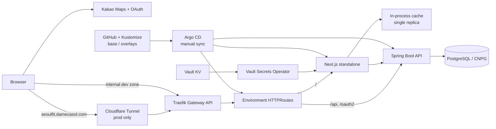

# Seoul Fit Frontend

서울의 공원·도서관·문화공간·따릉이 등 공공시설과 실시간 정보를 카카오 지도에서
탐색하는 Seoul Fit 웹 애플리케이션입니다.

## 현재 구성

- Next.js 15 App Router, React 19, TypeScript
- Tailwind CSS, Zustand
- 카카오 지도와 카카오 단일 OAuth
- 서울시 공공데이터를 사용하는 Route Handler와 서버 메모리 캐시·스케줄러
- Next.js standalone 컨테이너
- Kubernetes, Kustomize, Argo CD, Vault Secrets Operator, Traefik Gateway API



prod는 `https://seoulfit.damecasol.com`에서 Cloudflare Tunnel을 거쳐 공개됩니다.
dev는 내부 DNS 존에서만 접근합니다. 현재 서버 캐시와 스케줄러가 프로세스 안에
있어 Deployment는 1 replica로 고정합니다.

## 로컬 실행

Node.js 20 이상이 필요합니다. 환경 변수 목록과 공개/서버 전용 구분은
[`.env.example`](.env.example)이 정본입니다.

```bash
git clone https://github.com/seoul-fit/seoul-fit-fe.git
cd seoul-fit-fe
npm ci
cp .env.example .env.local
# .env.local에 본인 환경의 값 입력
npm run dev
```

브라우저에서 `http://localhost:3000`을 엽니다. 로컬 backend의 기본 주소는
`http://localhost:8080`으로 설정하면 됩니다.

`NEXT_PUBLIC_*` 변수는 브라우저 번들에 포함되므로 비밀값을 넣으면 안 됩니다.
카카오 지도와 날씨, 서울시 데이터 조회에는 각 제공자의 유효한 키가 필요하지만,
키가 없어도 개발 서버 자체는 기동할 수 있습니다.

```bash
npm run type-check
npm test
npm run build
```

`next build`는 환경 변수 없이도 완료되도록 구성되어 있습니다. 실제 지도·OAuth
동작 검증에는 유효한 `.env.local`이 필요합니다.

## 환경 변수 역할

| 구분           | 변수                              | 용도                                    |
| -------------- | --------------------------------- | --------------------------------------- |
| build/public   | `NEXT_PUBLIC_APP_URL`             | 브라우저가 보는 앱 origin               |
| build/public   | `NEXT_PUBLIC_BACKEND_URL`         | 브라우저의 backend 요청 주소            |
| build/public   | `NEXT_PUBLIC_KAKAO_CLIENT_ID`     | 카카오 OAuth 공개 client id             |
| build/public   | `NEXT_PUBLIC_KAKAO_MAP_API_KEY`   | 카카오 지도 JavaScript key              |
| build/public   | `NEXT_PUBLIC_KAKAO_REDIRECT_URI`  | OAuth callback override                 |
| build/public   | `NEXT_PUBLIC_GA_MEASUREMENT_ID`   | 동의 뒤에만 로드되는 GA4 Measurement ID |
| runtime/server | `BACKEND_INTERNAL_URL`            | Route Handler·SSR의 backend 주소        |
| runtime/server | `SEOUL_API_KEY`                   | 서울 열린데이터 요청 key                |

## 배포

애플리케이션 매니페스트는 [`infra/k8s/seoul-fit-fe`](infra/k8s/seoul-fit-fe)가
소유합니다.

- `base`: 1 replica Deployment, Service, ServiceAccount, Vault VSO 리소스
- `overlays/dev`, `overlays/prod`: backend 연결, HTTPRoute, 환경별 이미지 digest
- `output: 'standalone'` 산출물을 멀티스테이지 Dockerfile로 패키징합니다.
- `NEXT_PUBLIC_*`는 환경별 이미지 빌드 때 주입하므로 dev/prod 이미지가
  분리됩니다.
- 컨테이너 이미지는 tag가 아니라 `sha256` digest로 고정합니다.
- Argo CD Application `seoul-fit-fe-dev`와 `seoul-fit-fe-prod`는 각각 `master`의
  overlay를 추적하며 manual sync입니다.
- Vault Secrets Operator는 런타임 서버 전용 값을 Kubernetes Secret으로
  공급합니다.

Vault KV v2 경로는 다음과 같습니다. 경로만 공개하며 값은 저장소에 두지 않습니다.

- `kv/data/projects/seoul-fit/fe-dev`
- `kv/data/projects/seoul-fit/fe-prod`
- `kv/data/projects/seoul-fit/harbor-pull`

## 저장소 구조

```text
app/                               Next.js App Router and Route Handlers
src/                               feature-sliced UI and domain modules
instrumentation.ts                 server cache scheduler bootstrap
infra/k8s/seoul-fit-fe/            kustomize base and overlays
docs/BACKLOG.md                    deferred work and rationale
```

계획적으로 미룬 작업과 현재 제한은 [`docs/BACKLOG.md`](docs/BACKLOG.md)에
기록합니다.

검색 노출, Search Console·Cloudflare 최종 연결, GA4 퍼널의 공개 URL·이벤트·운영
체크리스트는
[`docs/SEO_ANALYTICS_IMPLEMENTATION_PLAN.md`](docs/SEO_ANALYTICS_IMPLEMENTATION_PLAN.md)에
정리되어 있습니다. 외부 콘솔 설정은 코드 검증 후 마지막 게이트에서 수행합니다.

실시간 생활 의사결정 지도라는 제품 목표와 P0~P3 기능 범위·데이터 계약·단계별
완료 기준은
[`docs/PRODUCT_IMPLEMENTATION_PLAN.md`](docs/PRODUCT_IMPLEMENTATION_PLAN.md)를
정본으로 사용합니다.

## License

[MIT](LICENSE)
