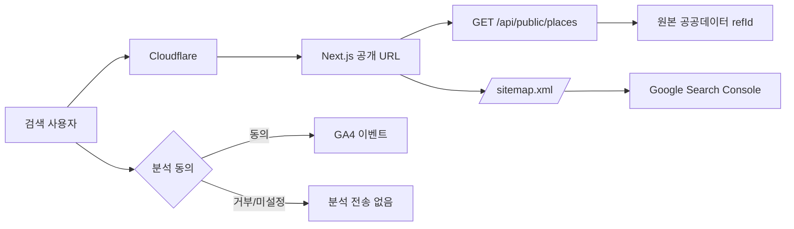

# SEO·검색 콘솔·Cloudflare·퍼널 분석 구현 계획

## 목표와 원칙

서울시 공공 장소를 검색 가능한 공개 URL로 제공하고, Google Search
Console(GSC)·GA4·Cloudflare를 연결해 유입부터 장소 행동까지의 퍼널을 측정한다.
외부 콘솔의 설정, DNS 변경, 보안 규칙 활성화는 코드·문서·배포 검증이 끝난
**마지막 사용자 게이트**에서만 수행한다.

| 범위                                   | 상태 | 구현 위치 또는 최종 작업                        |
| -------------------------------------- | ---- | ----------------------------------------------- |
| 기본 메타데이터, canonical, Open Graph | 구현 | `app/layout.tsx`, 각 장소 페이지                |
| 크롤러 제어와 sitemap                  | 구현 | `app/robots.ts`, `app/sitemap.ts`               |
| 검색 노출용 장소 목록·상세 URL         | 구현 | `/places/*`, backend `/api/public/places/*`     |
| 동의 기반 GA4 이벤트                   | 구현 | `src/shared/lib/analytics`, `AnalyticsProvider` |
| GA4 property·GSC·Cloudflare 대시보드   | 보류 | 마지막 외부 연결 게이트                         |

## 공개 URL 및 색인 정책

| URL                                                            | 공개/색인                      | 목적                                                |
| -------------------------------------------------------------- | ------------------------------ | --------------------------------------------------- |
| `/`                                                            | 색인                           | 지도 서비스 랜딩                                    |
| `/places`                                                      | 색인                           | 공원·도서관·맛집 탐색 허브                          |
| `/places/{park,library,restaurant}`                            | 색인                           | 상시 데이터의 목록·상세                             |
| `/places/{cultural-event,cultural-reservation,cooling-center}` | `noindex, follow`, 자동 sitemap 제외 | 날짜·계절성 데이터. 편집 신선도 정책 도입 뒤 재검토 |
| `/profile`, `/auth/*`, `/api/*`                                | 색인 제외                      | 개인 계정·인증·API 경로                             |

상세 URL의 ID는 매일 재구성될 수 있는 POI 검색 인덱스 ID가 아니라 원본 데이터의
`refId`다. 따라서 검색 인덱스 배치가 재실행돼도 공개 URL, canonical, sitemap
주소가 유지된다.

`sitemap.xml`은 프로덕션 canonical host(`https://seoulfit.damecasol.com`)에서만
생성하고 상시 데이터만 수집한다. backend를 일시적으로 읽지 못해도 기본 정적
URL은 반환한다. Google은 sitemap을 발견 힌트로 취급하므로, 개별 URL의
응답·canonical·품질도 함께 확인해야 한다.
[Google sitemap 가이드](https://developers.google.com/search/docs/crawling-indexing/sitemaps/build-sitemap)

## 데이터 흐름

## GA4 퍼널 설계

### 공통 규칙

- `NEXT_PUBLIC_GA_MEASUREMENT_ID`가 비어 있으면 GA4 스크립트, 배너, 이벤트가
  모두 비활성이다.
- 사용자가 명시적으로 동의한 뒤에만 GA4를 로드한다. 거부 후에도 `분석 설정`에서
  선택을 다시 할 수 있다.
- 이벤트에는 검색어, 정확한 좌표, 시설 ID·이름·주소·전화번호, 사용자 ID·이메일,
  OAuth code/token을 보내지 않는다. Google Analytics에는 식별 가능한 개인 정보를
  전송하면 안 된다.
  [GA 개인정보 보호 정책](https://support.google.com/analytics/answer/6366371)
- 페이지뷰는 query string을 제거한 path만 사용한다.

| 이벤트                              | 발생 시점                         | 허용 파라미터                  | 퍼널 단계      |
| ----------------------------------- | --------------------------------- | ------------------------------ | -------------- |
| `page_view`                         | 동의 후 화면 이동                 | `page_path`, `page_type`       | 방문           |
| `map_ready`                         | 지도 SDK 준비 완료                | `page_type=home_map`           | 지도 사용 가능 |
| `geolocation_result`                | 위치 권한 결과                    | `location_permission`          | 개인화 진입    |
| `discovery_started`                 | 카테고리·검색 결과·검색 기록 선택 | `selection_source`, `category` | 탐색 시작      |
| `facility_detail_viewed`            | 마커/클러스터 상세 열기           | `selection_source`, `category` | 관심 장소 확인 |
| `facility_action_clicked`           | 지도·전화·공식 URL CTA            | `action_type`, `category`      | 전환 행동      |
| `login_started` / `login_completed` | Kakao 시작/완료                   | `entry_point`, `result`        | 인증           |
| `signup_completed`                  | 회원가입 완료                     | `result=new_user`              | 활성화         |
| `preferences_saved`                 | 관심사 저장 성공                  | `page_type=profile`            | 재방문 개인화  |

GA4 Explore에서 아래 순서로 **닫힌 퍼널**을 만든다. 첫 단계의 기간은 주간 또는
월간으로 시작하고, `facility_action_clicked`은 전화·외부 공식 링크·지도 CTA를
함께 보되 `action_type`으로 분해한다.

1. `page_view` where `page_type = home_map`
2. `map_ready`
3. `discovery_started`
4. `facility_detail_viewed`
5. `facility_action_clicked`

가입 퍼널은 `login_started → login_completed`와
`login_started → signup_completed`를 별도 Explore로 비교한다. GA4 Funnel
exploration은 event 조건과 순서를 기준으로 이탈을 분석할 수 있다.
[GA4 Funnel exploration 가이드](https://support.google.com/analytics/answer/9327974)

## Cloudflare 운영 규칙 (최종 게이트에서 적용)

1. DNS/Tunnel 원본과 `seoulfit.damecasol.com`이 HTTPS로 정상 연결되는지 먼저
   확인한다. HTTP는 HTTPS로 redirect하고 canonical host를 단일화한다.
2. Web Analytics는 proxy된 사이트의 자동 설정을 우선 사용한다. 수동 beacon을
   추가하지 않아 GA4와 Cloudflare Web Analytics 또는 중복 beacon 사이의 이중
   계측을 피한다. SPA는 History API 기반 자동 페이지 추적을 확인한다.
   [Cloudflare Web Analytics 시작하기](https://developers.cloudflare.com/web-analytics/get-started/),
   [SPA 추적](https://developers.cloudflare.com/web-analytics/get-started/web-analytics-spa/)
3. Cache Rule은 우선 초안 상태에서 URL별 결과를 확인한다.
   - Bypass: `/api/*`, `/auth/*`, `/profile/*`, Cookie 또는 Authorization이 있는
     요청, `POST/PUT/PATCH/DELETE`.
   - 캐시 후보: 익명 `GET/HEAD`의 `/places/*`, `/sitemap.xml`, `/robots.txt`.
   - 상한: sitemap·공개 장소 페이지는 backend 재검증 주기와 같은 1시간부터
     시작한다. `Cache Everything`을 전체 사이트에 적용하지 않는다.
4. WAF/Rate Limiting은 로그인·API 정상 흐름을 최소 세션으로 검증한 뒤 적용한다.
   403/429, cache status, origin request 수를 대시보드에서 확인한다.
   [Cloudflare Cache Rules 가이드](https://developers.cloudflare.com/cache/how-to/cache-rules/)

## Google 최종 연결 체크리스트

이 단계를 실행하려면 사용자 또는 도메인 관리자의 DNS·GSC·GA4 권한이 필요하다.

1. GSC에서 Domain property `damecasol.com` 또는 URL-prefix property
   `https://seoulfit.damecasol.com/`를 만들고, 안내된 DNS TXT 레코드 또는
   지원되는 검증 방법으로 소유권을 확인한다.
2. `https://seoulfit.damecasol.com/robots.txt`,
   `https://seoulfit.damecasol.com/sitemap.xml`, 대표 상세 URL 3개가
   200·canonical·noindex 정책과 일치하는지 curl과 URL Inspection으로 확인한다.
3. GSC에 sitemap URL을 제출하고, `Sitemaps` 보고서의 읽기 성공 및 excluded
   사유를 48시간 이상 관찰한다.
4. GA4 Web data stream을 만들고 Measurement ID를 `NEXT_PUBLIC_GA_MEASUREMENT_ID`
   build argument로 주입해 frontend 이미지를 다시 빌드·배포한다. 브라우저 동의
   뒤 DebugView에서 `map_ready`와 `facility_action_clicked`을 확인한다. GA4
   이벤트는 `gtag()`로 전송한다.
   [GA4 이벤트 수집 가이드](https://developers.google.com/analytics/devguides/collection/ga4/events)
5. GA4 Editor와 GSC verified owner 권한으로 GA4↔Search Console link를 만든다.
   그러면 organic search 관련 보고서를 함께 볼 수 있다.
   [GA4–Search Console 연결 가이드](https://support.google.com/analytics/answer/10737381)

GSC 도메인 소유권 확인에는 DNS 레코드가 가장 범위가 넓으며, URL-prefix는 GA tag
등으로도 검증할 수 있다. 실제 화면의 레코드 값은 GSC가 생성한 값을 그대로
사용한다.
[Search Console 소유권 확인](https://support.google.com/webmasters/answer/9008080?hl=en)

## 릴리스 전 검증 기준

- `npm run type-check`, `npm test`, `npm run build` 및 backend
  `./gradlew test`가 성공한다.
- 프로덕션 URL에서 `/robots.txt`, `/sitemap.xml`, `/places`, 상시 카테고리별
  목록·상세가 200이고 auth/profile은 noindex다.
- HTML source에서 canonical·Open Graph·JSON-LD가 하나씩 있고, sitemap에
  canonical HTTPS URL만 포함된다.
- Measurement ID가 없을 때 `googletagmanager.com` 요청과 GA 이벤트가 0건이다.
- Measurement ID가 있을 때에도 동의 전 0건, 동의 후 DebugView 이벤트와 선택한
  CTA만 관찰된다.
- 임시·계절성 카테고리와 2페이지 이후 목록은 `noindex, follow`이며, sitemap에는
  상시 콘텐츠 URL만 있다.
- JSON-LD는 외부 데이터의 script 탈출 문자를 이스케이프하고, 공용 응답은 기본
  보안 헤더를 포함한다.

## 미결정 사항

- 분석 동의 문구·보관 기간·개인정보 처리방침은 운영/법무 책임자가 최종 승인한다.
- 문화행사·예약·무더위쉼터의 자동 색인은 데이터 만료·삭제·갱신 기준이 정해진
  뒤에만 켠다.
- Search Console의 초기 색인 수·쿼리 데이터는 즉시 채워지지 않으므로, 외부 연결
  뒤 주 단위로 baseline을 기록한다.
